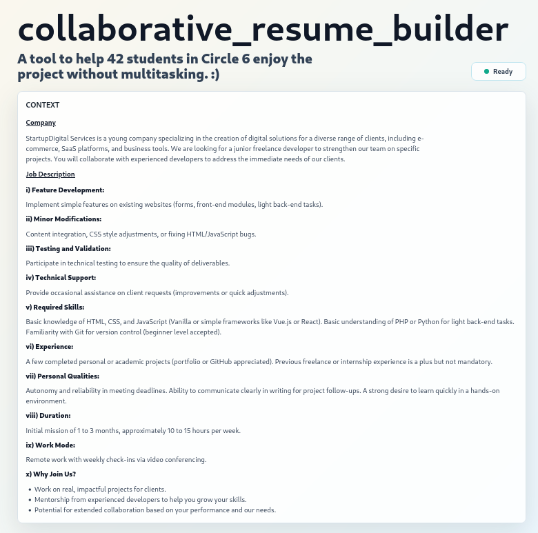
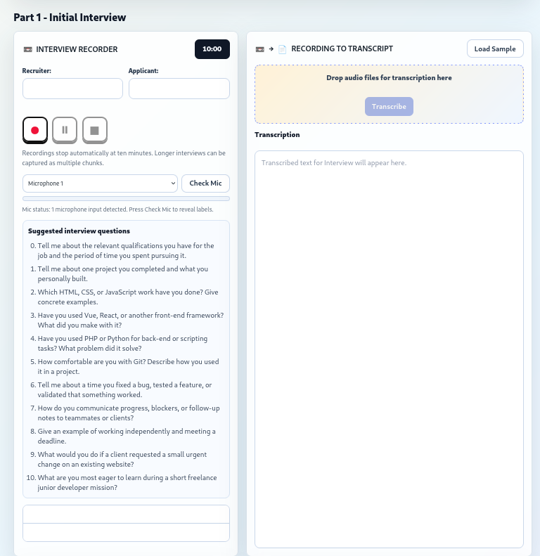
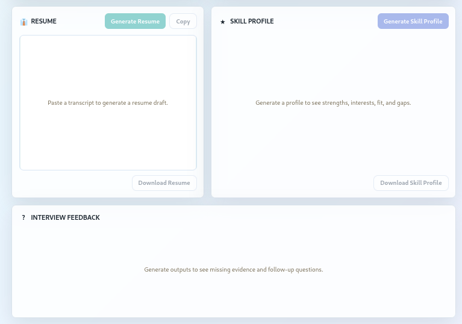
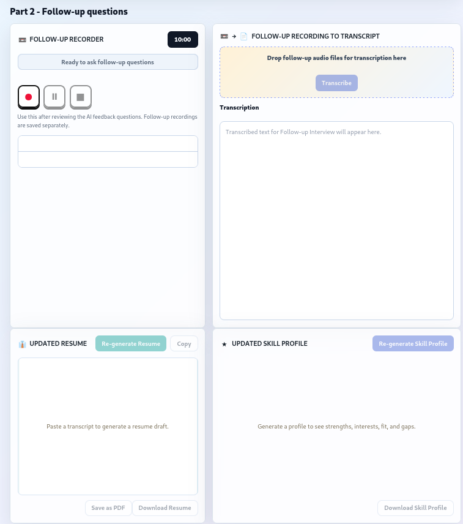
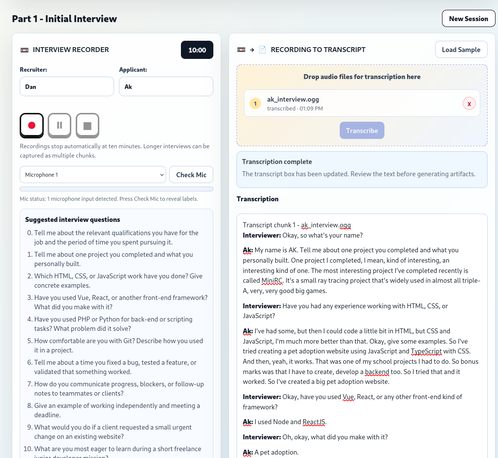
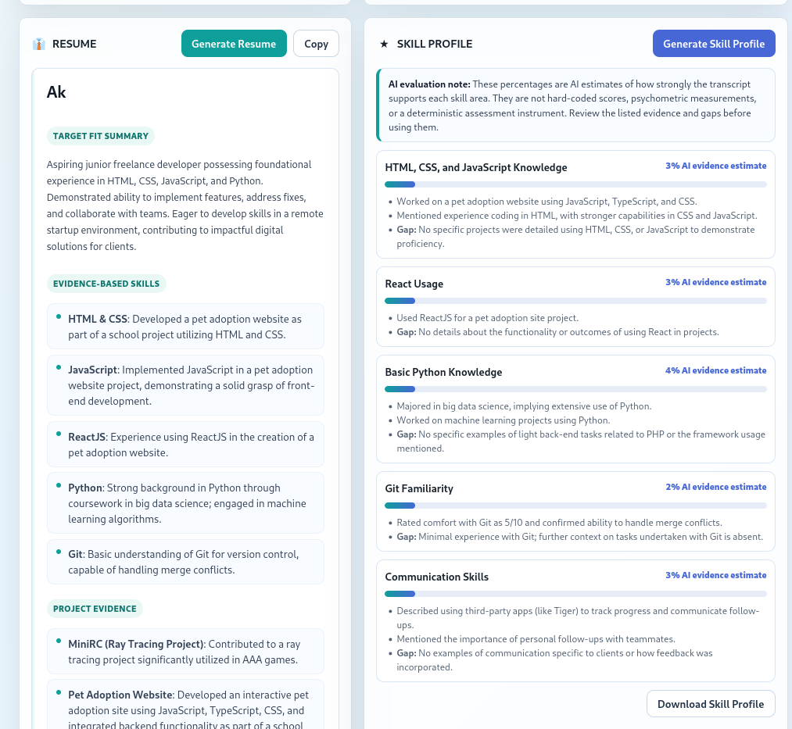
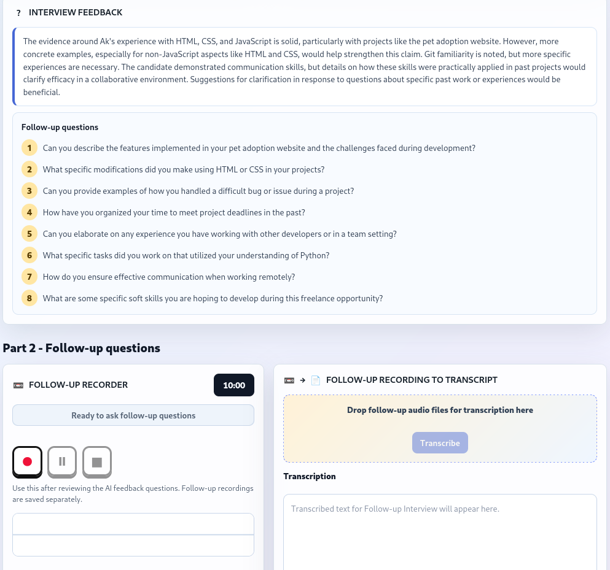

# collaborative_resume_builder

## Overview

collaborative_resume_builder is an AI-assisted interview and resume-building prototype for 42 students working on the `collaborative_resume` project.

It helps a pair of students conduct an interview without multitasking between listening, note-taking, transcription, resume drafting, and evidence checking. The app records interview audio, transcribes it through a local AI backend, generates an evidence-based resume draft, identifies missing evidence, suggests follow-up questions, and lets the user regenerate the final resume after a second follow-up interview.

The working product description is:

```text
A tool to help 42 students in Circle 6 enjoy the project without multitasking. :)
```

### Problem

The `collaborative_resume` project asks students to interview each other, gather detailed information, write a professional resume for their partner, review it, and export the result as PDF.

This creates several practical difficulties:

- The interviewer must listen, ask useful questions, and take precise notes at the same time.
- Important resume evidence can be missed during the first interview.
- AI-generated resumes can invent or overstate claims if the transcript evidence is weak.
- Students need a clear way to see what is supported by the interview and what still needs follow-up.

### Outcome

This prototype turns the exercise into a two-part workflow:

1. Part 1 records and transcribes the initial interview, then generates an initial resume, skill profile, and missing-evidence feedback.
2. Part 2 records and transcribes follow-up answers, then regenerates the resume and skill profile from the combined evidence.

Current measurable outcomes:

- Browser-based audio recording in 10-minute chunks.
- Automated transcription through a local backend.
- Gemini-first AI calls with OpenAI fallback where configured.
- Evidence-governed resume generation.
- Skill-profile cards with model-assigned evidence strength.
- Follow-up question generation for missing evidence.
- Final updated resume export through browser PDF printing.

This is a prototype, not a validated hiring assessment system.

## Reviewer Quick Links

- Open the visual flow page: [`collaborative_resume_builder_flow.html`](collaborative_resume_builder_flow.html)
- Direct flow page: [`docs/collaborative_resume_builder_flow.html`](docs/collaborative_resume_builder_flow.html)
- Technical build explanation: [`docs/TECHNICAL_BUILD.md`](docs/TECHNICAL_BUILD.md)

The flow pages are repository documentation. Open them directly from GitHub/repository view, or open the HTML files from the local folder in a browser. The local app server at `http://localhost:4173` serves the built prototype, not the documentation pages.

## Demo

From the user's perspective:

1. Open the app at `http://localhost:4173`.
2. Read the fixed `CONTEXT` section for the StartupDigital Services junior freelance developer mission.
3. In `Part 1 - Initial Interview`, enter the recruiter and applicant names.
4. Use `Check Mic` to confirm that the browser can hear the microphone.
5. Ask the suggested interview questions and press the record button.
6. Stop the recording. The audio file appears in the recorder list and can be downloaded or transcribed immediately.
7. Transcribe the recording. The transcript appears in the transcription box with speaker labels.
8. Generate the initial resume.
9. Generate the skill profile and interview feedback.
10. Review the follow-up questions.
11. In `Part 2 - Follow-up questions`, click `Ready to ask follow-up questions`.
12. Record and transcribe follow-up answers.
13. Click `Re-generate Resume` to combine the first resume with the follow-up transcript.
14. Click `Re-generate Skill Profile` to refresh the profile using the updated evidence.
15. Use `Save as PDF` from the updated resume section to export `resume_(applicant name).pdf`.

For a reviewer-friendly visual version of this flow, open [`docs/collaborative_resume_builder_flow.html`](docs/collaborative_resume_builder_flow.html) in a browser.

### Screenshots

The screenshots below show the main user journey from context review to interview capture, resume generation, and follow-up questioning.















## Technology Stack

### Frontend components

- Vite 2.9
- TypeScript 4.9
- Browser MediaRecorder API for microphone capture
- Browser Web Audio API for microphone testing and waveform display
- HTML/CSS rendered from `src/main.ts`
- Local file download and browser print-to-PDF export

### Backend components

- Node.js local HTTP server in `server/index.cjs`
- `/api/transcribe` endpoint for audio transcription
- `/api/generate-artifacts` endpoint for resume/profile generation
- Server-side `.env` API key loading
- Gemini transcription/generation as the first provider
- OpenAI transcription/generation as fallback when configured

The backend exists so API keys do not need to be exposed in browser JavaScript.

For a deeper end-to-end explanation of how the browser, local server, audio APIs, AI providers, and export flow work together, see `docs/TECHNICAL_BUILD.md`.

## Development Approach With AI

### AI collaboration journey and evidence trail

This project was not built by blindly accepting AI output. The build followed a clarity-before-build process:

```text
Builder intent
-> AREN vision clarity
-> North Star and Architecture docs
-> Codex + KRYSTALIZE implementation clarity
-> working prototype
-> transcript/output testing
-> refinement and documentation
```

The repository documents this journey through several layers:

| Documentation | What it shows |
| --- | --- |
| [`docs/NORTH_STAR.md`](docs/NORTH_STAR.md) | The product purpose and long-term intent before implementation. |
| [`docs/ARCHITECTURE.md`](docs/ARCHITECTURE.md) | The conceptual system structure and current prototype architecture. |
| [`docs/TECHNICAL_BUILD.md`](docs/TECHNICAL_BUILD.md) | How the current stack works technically from browser recording to backend AI calls and export. |
| [`docs/AI_COLLABORATION.md`](docs/AI_COLLABORATION.md) | The roles of Builder, AREN, KRYSTALIZE, Codex, Gemini, and OpenAI. |
| [`docs/K_COLLABORATIVE_RESUME_BUILDER_CONSTITUTIONAL_STATE.md`](docs/K_COLLABORATIVE_RESUME_BUILDER_CONSTITUTIONAL_STATE.md) | Current stabilized understanding, locked truths, accepted uncertainty, and superseded assumptions. |
| [`docs/K_COLLABORATIVE_RESUME_BUILDER_CONSTITUTIONAL_JOURNAL.md`](docs/K_COLLABORATIVE_RESUME_BUILDER_CONSTITUTIONAL_JOURNAL.md) | The chronological clarification journey and rationale for major changes. |

The process matters because the final app evolved through testing and correction. For example, early keyword-based resume generation produced weak output, so the build moved to evidence-governed AI generation with explicit missing-evidence feedback. The follow-up interview loop was then added so the app could help collect the missing evidence instead of merely reporting gaps.

### AI tools, services, and models

- Codex was used as the main AI coding collaborator.
- Gemini API is used for transcription and evidence-governed generation when `GEMINI_API_KEY` is configured.
- OpenAI API is used as fallback when `OPENAI_API_KEY` is configured.
- Gemini app/manual transcription was kept as a fallback path when automated transcription fails.

### AI agent roles

- Builder: defines project intent, tests the app, rejects incoherent output, and makes product decisions.
- Arche Reconstruction & Engineering Nexus (AREN): a custom GPT used for high-level reasoning before implementation. AREN helped produce the North Star and Architecture documents so the project had vision clarity before coding began.
- KRYSTALIZE: used with Codex to preserve implementation clarity: state, locked truths, unresolved issues, rationale, dependencies, and semantic evolution.
- Codex: implements code changes, updates documentation, explains tradeoffs, and turns clarified decisions into working repository artifacts.
- Gemini/OpenAI generation layer: transcribes audio and generates structured evidence-based artifacts.

See `docs/AI_COLLABORATION.md` for the fuller collaboration-role breakdown.

The build method is clarity before build:

```text
AREN -> vision clarity
Codex + KRYSTALIZE -> implementation clarity
Codex -> working prototype
Gemini/OpenAI -> runtime AI features
```

### Key prompts and instructions

The backend prompts enforce these boundaries:

- Use the transcript as the only source for candidate claims.
- Use the job description only to evaluate fit and identify missing evidence.
- Do not invent skills, tools, dates, achievements, or project details.
- If a required job skill is not evidenced, mark it as a gap and ask a follow-up question.
- Return structured JSON for resume, profile cards, feedback, and follow-up questions.

The manual transcription fallback prompt asks the user to transcribe audio chunks in order, preserve speaker labels, combine the chunks, and avoid summarizing.

### Key review points and decisions

- Decision: build V1 before full Google Drive/Docs automation.
  Rationale: prove the interview-to-resume loop before spending effort on OAuth, Drive permissions, Docs formatting, or cloud storage.

- Decision: add automated transcription as V2A through a local backend.
  Rationale: transcription is the highest-value automation step, but it can be isolated from Google login and Drive integration.

- Decision: reject keyword-only resume generation.
  Rationale: early output was incoherent and treated weak keywords as evidence. Resume claims must be transcript-grounded.

- Decision: split the exercise into Part 1 and Part 2.
  Rationale: missing-evidence feedback should lead to a second interview pass, not sit unused on the screen.

- Decision: move PDF export to the updated Part 2 resume.
  Rationale: the final exported resume should include follow-up evidence.

## Installation

Install dependencies:

```sh
npm install
```

Create a local environment file:

```sh
cp .env.example .env
```

Add your own API keys to `.env`:

```sh
GEMINI_API_KEY=your_gemini_api_key_here
OPENAI_API_KEY=your_openai_api_key_here
```

At least one provider key is needed for automated transcription and AI generation. Gemini is tried first; OpenAI is used as fallback when configured.

Do not commit `.env`.

## Usage

For development:

```sh
npm run dev
```

For the local backend with transcription and generation:

```sh
npm run build
npm run serve
```

Then open:

```text
http://localhost:4173
```

Useful commands:

```sh
npm run build
node --check server/index.cjs
```

Expected behavior:

- If microphone permission is granted and input volume is active, the waveform and mic-level indicator should respond.
- If the recruiter or applicant name is missing in Part 1, recording is blocked with a message.
- If the Part 2 ready button has not been clicked, follow-up recording is blocked with a message.
- If automated transcription fails, the app shows a manual fallback prompt.
- If AI generation fails, the app keeps the transcript and reports the failure rather than inventing output.

## Project Structure

```text
collaborative_resume_builder/
├── README.md
├── LICENSE
├── .gitignore
├── package.json
├── index.html
├── server/
│   └── index.cjs
├── src/
│   ├── main.ts
│   └── styles.css
└── docs/
    ├── NORTH_STAR.md
    ├── ARCHITECTURE.md
    ├── AI_COLLABORATION.md
    ├── KRYSTALIZE.md
    ├── KRYSTALIZE_PROTOCOL_NOTES.md
    ├── TECHNICAL_BUILD.md
    ├── K_COLLABORATIVE_RESUME_BUILDER_CONSTITUTIONAL_STATE.md
    └── K_COLLABORATIVE_RESUME_BUILDER_CONSTITUTIONAL_JOURNAL.md
```

Key folders:

- `src/`: browser UI, recording logic, transcript handling, artifact rendering, PDF export.
- `server/`: local backend for AI transcription and generation.
- `docs/`: north star, architecture, technical build notes, AI collaboration notes, and Krystalize state/journal artifacts.
- `dist/`: generated production build, ignored by git.
- `node_modules/`: installed dependencies, ignored by git.

Tests are not yet present. Current verification is by TypeScript build, backend syntax check, and manual browser testing.

## V2A Transcription Notes

The app sends uploaded audio to `/api/transcribe`. The backend keeps API keys out of browser code.

Provider order:

1. Gemini, when `GEMINI_API_KEY` is present.
2. OpenAI, when `OPENAI_API_KEY` is present.
3. Manual fallback prompt, when automated transcription fails.

Audio files are currently sent inline from browser to backend, so files should stay below the configured inline size limit. Larger-file support can be added later through provider file-upload APIs.

## Evidence Evaluation Notes

Before calling Gemini or OpenAI for resume/profile generation, the backend performs a local evidence gate. If the transcript has no applicant answers, appears to be only a functionality test, contains irrelevant/non-work-related claims, or contains broad self-claims without concrete backing, the app returns an insufficient-evidence artifact instead of asking an AI model to invent a resume.

The app also treats claims and evidence differently. A candidate saying "I am good at JavaScript" is not enough by itself; the transcript should include a project, task, tool use, qualification, result, duration, or concrete example before that claim becomes resume evidence.

The skill profile uses model-generated evidence cards. Each card includes:

- `label`: skill or role-fit area.
- `evidenceStrength`: a 0-100 estimate of transcript support.
- `evidence`: transcript-grounded reasons.
- `gap`: missing or unclear evidence.

`evidenceStrength` is an AI-generated estimate. The app does not calculate this number with a hard-coded heuristic, rubric formula, psychometric instrument, or deterministic scoring engine. Gemini/OpenAI returns the estimate after reasoning over the transcript evidence and comparing it against the job description.

Because the model's internal reasoning is not fully inspectable, the number should be treated as AI judgment, not objective measurement. The useful part is the visible evidence and gap text beside each score: participants can inspect what the AI used to justify the estimate and decide whether more follow-up questions are needed.

Low scores should guide better follow-up questions. They should not be used as hiring scores or formal ability scores.

## Privacy and Responsibility

The `collaborative_resume` project involves personal resume information. Users should:

- Avoid recording private information that should not appear in a resume.
- Review AI-generated text before exporting.
- Remove unsupported or sensitive claims.
- Only publish or submit resumes that belong to them or that they have permission to submit.
- Delete intermediate private documents after project validation if required by the school project.

## Reflection

### What worked

- Starting with the workflow before automation made the product easier to understand.
- Browser recording was enough to prove the interview-capture layer.
- The local backend gave a clean place to protect API keys.
- AI-generated feedback became more useful once it drove a follow-up interview pass.

### What failed or changed

- The first keyword-based resume generator produced weak and sometimes incoherent output.
- Treating skill percentages as calculated scores was misleading.
- A one-pass interview flow did not fully solve the resume evidence problem.
- Google login, Drive, and Docs automation were intentionally deferred.

### Rationale for current shape

The current app is designed to show a practical AI-assisted development prototype for the B1 Builders Programme:

- It has frontend and backend components.
- It uses AI as a co-developer and as a runtime service.
- It preserves a clear boundary between transcript evidence and AI interpretation.
- It demonstrates iterative improvement from rough prototype to more responsible workflow.
