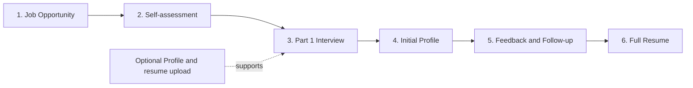
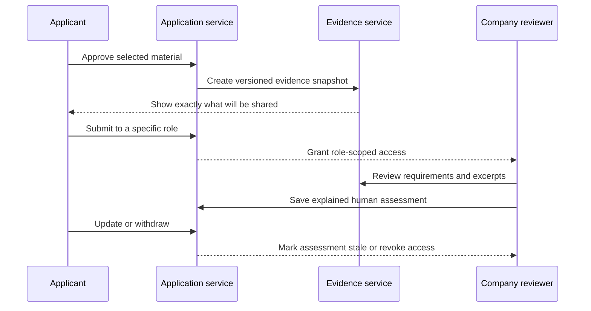
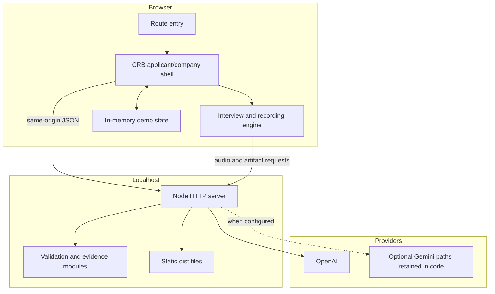
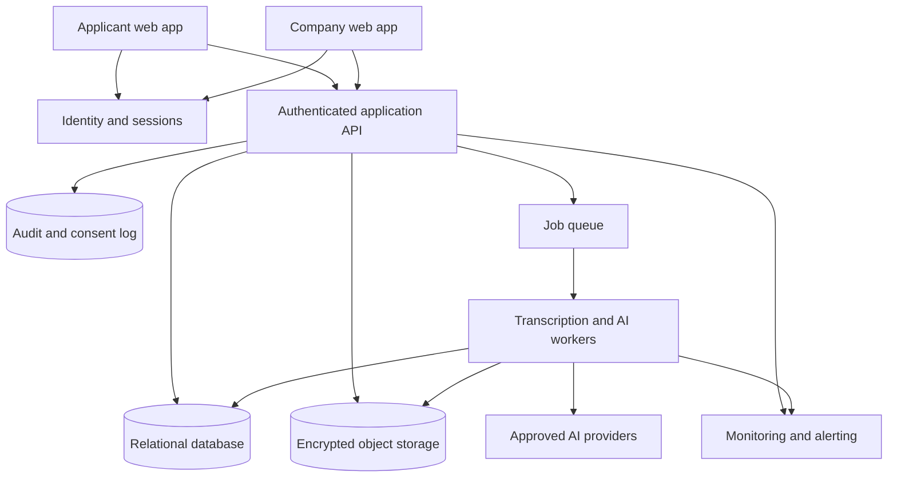

# Collaborative Resume (Contribution) Builder — CRB

CRB is an AI-assisted prototype that helps a job applicant understand an opportunity, examine the evidence behind their capabilities, and prepare an honest, contribution-focused resume. It also demonstrates how an employer could review candidate-approved evidence against confirmed role requirements.

> **Understand the need. Develop the capability. Demonstrate the contribution.**

The repository contains a **local working demonstration**, not a production hiring platform. It includes completed fictional applicant and company journeys, a live job-description and interview workflow, browser audio recording and transcription, evidence-grounded resume generation, and transparent evidence-coverage visuals.

## Contents

- [Product purpose](#product-purpose)
- [Current capabilities](#current-capabilities)
- [Quick start](#quick-start)
- [Demo access](#demo-access)
- [Applicant journey](#applicant-journey)
  - [Completed applicant demonstration](#completed-applicant-demonstration)
  - [Live applicant workflow](#live-applicant-workflow)
  - [Evidence coverage](#evidence-coverage)
- [Company journey](#company-journey)
  - [Completed company demonstration](#completed-company-demonstration)
  - [Applicant-to-company sharing](#applicant-to-company-sharing)
- [Current demo architecture](#current-demo-architecture)
  - [Frontend](#frontend)
  - [Local backend](#local-backend)
  - [AI endpoints](#ai-endpoints)
  - [State and data boundaries](#state-and-data-boundaries)
  - [Security controls](#security-controls)
- [Production architecture required](#production-architecture-required)
  - [Recommended services](#recommended-services)
  - [Production data model](#production-data-model)
  - [Authentication and sharing](#authentication-and-sharing)
  - [Storage and long interviews](#storage-and-long-interviews)
  - [AI and evidence pipeline](#ai-and-evidence-pipeline)
  - [Employer review integrity](#employer-review-integrity)
- [Repository structure](#repository-structure)
- [Configuration](#configuration)
- [Development commands](#development-commands)
- [Testing](#testing)
- [Current limitations](#current-limitations)
- [Recommended delivery phases](#recommended-delivery-phases)
- [Related documentation](#related-documentation)

## Product purpose

Traditional resume tools often begin by asking applicants to promote themselves. CRB begins with a different question:

> What does this organisation need to achieve, and how can I contribute?

The product helps an applicant:

1. understand the work, outcomes and capabilities required by a real opportunity;
2. reflect on experience without treating confidence as proof;
3. connect examples to the organisation's needs;
4. distinguish demonstrated capability from self-report and missing evidence;
5. generate a resume containing supported claims; and
6. identify practical development needs.

CRB does not make hiring decisions. Evidence coverage describes the material supplied against role requirements. It is not a prediction of performance, a psychometric result, or an automatic ranking.

## Current capabilities

| Capability | Status |
| --- | --- |
| Applicant and company landing pages | Working |
| One-click completed applicant journey | Working with fictional data |
| One-click company board with three candidates | Working with fictional approved records |
| Job URL, document and pasted-description input | Working |
| AI company/job extraction | Working with a configured provider |
| Editable stated requirements and interpretations | Working |
| Opportunity-specific questions | Working |
| Typed self-assessment | Working |
| Browser recording, upload and transcription | Working |
| Incremental transcription recovery and retry | Working |
| Initial and updated resumes/candidate profiles | Working |
| Colour-coded evidence coverage | Working in completed demos |
| Applicant-controlled company sharing | Working for one in-tab snapshot |
| Production accounts, database and cross-device sessions | Not implemented |
| Real multi-applicant company board | Not implemented; current records are fixtures |

The complete original interview surface remains at `/interview` for comparison and its full recording controls.

## Quick start

CRB requires Node.js 24 or newer.

```sh
npm ci
cp .env.example .env
```

Add an OpenAI API key to `.env`, then run:

```sh
npm run build
npm run serve
```

Open [http://localhost:4173/applicant](http://localhost:4173/applicant).

The server binds to `127.0.0.1`. It is intended for local use and should not be exposed directly to a public network.

## Demo access

The landing page provides two one-click paths:

- **Try the completed applicant demo** opens a fictional, moderately matched applicant named Daniel Tan.
- **View the company demo** opens three fictional candidates for the same SUTD Business and AI role.

Traditional demo logins also remain available:

| Workspace | Login | Password | Address |
| --- | --- | --- | --- |
| Applicant | `applicant` | `hireme` | [Applicant](http://localhost:4173/applicant) |
| Company | `company` | `rightfit` | [Company](http://localhost:4173/company) |

These visible credentials are interface fixtures and provide no security boundary.

## Applicant journey

The applicant workspace has six stages. The optional **Profile** page sits in the top bar so contact entry does not interrupt reflection and interview practice.


```mermaid
flowchart LR
  A[1. Job Opportunity] --> B[2. Self-assessment]
  B --> C[3. Part 1 Interview]
  C --> D[4. Initial Profile]
  D --> E[5. Feedback and Follow-up]
  E --> F[6. Full Resume]
  P[Optional Profile and resume upload] -. supports .-> C
```

### Completed applicant demonstration

The one-click demonstration uses an SUTD Practice-Track Faculty opportunity in Business and AI. It loads locally without consuming API credits. Its fictional applicant has credible transformation, facilitation, applied-project and partnership experience, alongside visible gaps in semester-long university teaching, research supervision and independent AI-governance depth.

Every stage is populated:

1. **Job Opportunity** — editable description, stated requirements and labelled interpretation.
2. **Self-assessment** — eight numbered, opportunity-grounded questions.
3. **Part 1 Interview** — realistic text answers with bounded claims and measurable examples.
4. **Generate Initial Profile** — initial resume, candidate profile and evidence chart.
5. **Part 2 — Feedback and Follow-up** — supported capabilities, self-report, gaps, targeted questions and further answers.
6. **Full Resume** — updated resume, candidate profile and revised evidence coverage.
7. **Profile** — fictional contact, education and capability information.

All fields remain editable. Existing AI controls can regenerate outputs after the user changes the source material.

### Live applicant workflow

#### 1. Job Opportunity

The applicant can paste a public job URL, upload a job document, or paste a description. Extracted fields remain editable. **Understand the role with AI** produces requirements labelled **Stated in the job posting** or **AI interpretation — needs confirmation**, with source excerpts where available.

#### 2. Self-assessment

The applicant generates or edits approximately eight questions. A short typed answer can be added directly to the transcript. An optional AI reflection identifies situation, action and outcome excerpts while keeping the original answer unchanged. The interface encourages one useful example at a time rather than requiring a long questionnaire.

#### 3. Part 1 Interview

The applicant can continue with text or use audio. The browser can test the microphone, record, upload audio and request transcription. Speaker labels remain editable; uncertain speakers are not automatically assigned to the applicant.

Recordings use ten-minute browser-managed segments. Transcription commits each successful result before marking it complete. If a later segment fails, earlier text remains and retry targets missing items.

#### 4. Generate Initial Profile

The server receives applicant evidence, direct profile fields and opportunity context. It can produce an initial resume, candidate profile, evidence feedback and follow-up questions. The job description determines relevance but is never a source for candidate claims.

#### 5. Part 2 — Feedback and Follow-up

Feedback distinguishes supported capability, self-report, missing evidence and development needs. The applicant can clarify through text or a second recording. Additional answers may reveal existing capability; answering a question does not demonstrate a newly acquired skill.

#### 6. Full Resume

The updated resume combines accepted initial and follow-up evidence. The applicant can inspect outputs, download available artifacts and choose the exact examples approved for company viewing. Private interviewer statements, recordings and unapproved text are excluded automatically.

### Evidence coverage

| State | Colour | Points | Meaning |
| --- | --- | ---: | --- |
| Supported by examples | Green | 1 | A relevant example exists in the supplied evidence. |
| Partially supported | Amber | 0.5 | Evidence exists with an important limitation or ambiguity. |
| Self-reported | Blue | 0 | A claim lacks a sufficient example. |
| No evidence yet | Grey | 0 | Current material does not address the requirement. |

```text
evidence coverage = (supported points + partial points) / applicable requirements
```

Each requirement expands to show its excerpt and reasoning. Demo classifications can be corrected and the percentage recalculates. Missing evidence is not treated as proof of inability.

## Company journey

### Completed company demonstration

The one-click board shows three fictional candidates alphabetically:

- **Aisha Rahman** — stronger curriculum, teaching and responsible-AI evidence; less industry-transformation leadership.
- **Daniel Tan** — stronger transformation, facilitation and partnership evidence; less university-teaching and governance evidence.
- **Marcus Lee** — stronger entrepreneurship, investment and industry-network evidence; less structured teaching and assessment evidence.

The board does not sort candidates by score. For each candidate, a reviewer can inspect contribution, evidence coverage, requirement-level excerpts, gaps and suggested interview questions. Reviewers can record **Not yet assessed**, **Needs clarification**, **Partially meets**, or **Meets the expectation**. A reason is required before saving a substantive assessment.

### Applicant-to-company sharing

The prototype currently has two related behaviours:

1. A live applicant can approve a snapshot in **Full Resume**. The single company review view can display it in the same browser tab.
2. The three-candidate board uses prepared fictional records. Daniel's facts align with the applicant demo, but the board is not populated from three independent accounts or a database.

A production flow should be:


```mermaid
sequenceDiagram
  participant A as Applicant
  participant API as Application service
  participant E as Evidence service
  participant C as Company reviewer
  A->>API: Approve selected material
  API->>E: Create versioned evidence snapshot
  E-->>A: Show exactly what will be shared
  A->>API: Submit to a specific role
  API-->>C: Grant role-scoped access
  C->>E: Review requirements and excerpts
  C->>API: Save explained human assessment
  A->>API: Update or withdraw
  API-->>C: Mark assessment stale or revoke access
```

## Current demo architecture


```mermaid
flowchart TB
  subgraph Browser
    R[Route entry]
    N[CRB applicant/company shell]
    I[Interview and recording engine]
    D[In-memory demo state]
    R --> N
    N --> I
    N <--> D
  end
  subgraph Localhost
    S[Node HTTP server]
    V[Validation and evidence modules]
    X[Static dist files]
    S --> V
    S --> X
  end
  subgraph Providers
    O[OpenAI]
    G[Optional Gemini paths retained in code]
  end
  N -->|same-origin JSON| S
  I -->|audio and artifact requests| S
  S --> O
  S -. when configured .-> G
```

### Frontend

The frontend uses Vite, TypeScript and browser-native APIs without a UI framework.

| File | Responsibility |
| --- | --- |
| `src/entry.ts` | Selects the CRB shell or original interview view. |
| `src/native-shell.ts` | Routes, six-stage navigation, demos, sharing and company review. |
| `src/main.ts` | Interview fields, recording, transcription, generation and export. |
| `src/applicant-demo.ts` | Completed fictional applicant fixture. |
| `src/company-demo.ts` | Fictional three-candidate board fixtures. |
| `src/demo-access.ts` | Demo login and approved-material helpers. |
| `src/resume-import.ts` | Resume upload and reviewed field filling. |
| `src/transcription.ts` | Incremental transcription batch and retry logic. |
| `src/native-shell.css` | CRB, evidence-chart and company-board styles. |
| `src/styles.css` | Interview and generated-document styles. |

Browser APIs handle microphone permission, MediaRecorder capture, waveform display, downloads and print-to-PDF behaviour.

### Local backend

`server/index.cjs` uses Node's built-in HTTP and HTTPS modules. It loads `.env`, serves `dist/`, accepts bounded same-origin JSON, fetches approved public job URLs, calls AI providers and validates responses. It binds to `127.0.0.1:4173` by default.

Supporting modules separate URL security, runtime validation, opportunity extraction, answer reflection, evidence selection, response schemas and resume import.

### AI endpoints

| Method and path | Purpose |
| --- | --- |
| `GET /api/ai-status` | Reports provider configuration. |
| `POST /api/extract-job-url` | Fetches a public job page and extracts job information. |
| `POST /api/extract-job-document` | Extracts job information from submitted text. |
| `POST /api/understand-opportunity` | Produces editable role requirements. |
| `POST /api/generate-interview-questions` | Generates opportunity-grounded questions. |
| `POST /api/reflect-answer` | Selects supported excerpts from an answer. |
| `POST /api/import-resume` | Produces reviewable field suggestions from PDF, DOCX or text. |
| `POST /api/transcribe` | Transcribes one audio segment. |
| `POST /api/generate-artifacts` | Generates resume, profile and feedback artifacts by mode. |

Keys remain in the server process. Resume import requests OpenAI response storage to be disabled.

### State and data boundaries

Workspace state lives in browser memory and mounted fields. Navigation preserves it; refresh, tab closure or a crash does not. One-click datasets are source-controlled fictional fixtures and do not prove multi-user data flow.

The prototype has no database, durable recovery, server-side user record, cross-browser sharing, real tenant separation or audit log. Browser downloads save recordings and artifacts to the user's computer; the app does not automatically store them in a cloud service.

### Security controls

The reviewed localhost backend includes:

- loopback-only binding;
- Host, Origin and Fetch Metadata checks;
- a required non-simple header for POST requests;
- JSON content-type and body-size enforcement;
- request and provider timeouts;
- static-file path boundary checks;
- public HTTP(S)-only job URLs on standard ports;
- DNS resolution and rejection of private/special-purpose addresses;
- socket pinning to reduce DNS-rebinding risk; and
- bounded redirects and response sizes.

These measures do not replace production authentication. Local processes are trusted and visible demo passwords are not credentials.

## Production architecture required

A proper build can retain the current interview, evidence, validation and approval concepts while moving identity, storage and processing behind authenticated services.


```mermaid
flowchart TB
  AW[Applicant web app] --> ID[Identity and sessions]
  CW[Company web app] --> ID
  AW --> API[Authenticated application API]
  CW --> API
  API --> DB[(Relational database)]
  API --> OBJ[(Encrypted object storage)]
  API --> AUD[(Audit and consent log)]
  API --> Q[Job queue]
  Q --> W[Transcription and AI workers]
  W --> AI[Approved AI providers]
  W --> DB
  W --> OBJ
  API --> OBS[Monitoring and alerting]
  W --> OBS
```

### Recommended services

| Service | Responsibility |
| --- | --- |
| Applicant app | Opportunity input, low-friction reflection, recording, review and consent. |
| Company app | Confirmed requirements, approved evidence and human assessment. |
| Identity service | Registration, verification, recovery, MFA options and secure sessions. |
| Application API | Authorization, validation, versioning and rate limits. |
| Relational database | Users, organisations, roles, applications, evidence and assessments. |
| Object storage | Encrypted multipart audio, uploads and exports. |
| Queue and workers | Retryable transcription, extraction, evidence analysis and generation. |
| Audit service | Consent, approval, withdrawal, access and assessment history. |
| Observability | Logs, metrics, traces, cost monitoring and alerts without sensitive-content leakage. |

### Production data model

| Entity | Purpose |
| --- | --- |
| `User` | Applicant or company-reviewer identity. |
| `Organisation` | Company tenant and membership boundary. |
| `Opportunity` | Employer-owned role and lifecycle. |
| `Requirement` | Versioned stated/interpretive requirement with provenance and confirmation. |
| `ApplicantProfile` | Applicant-owned profile data. |
| `InterviewSession` | Applicant-owned work linked to an opportunity. |
| `RecordingSegment` | Sequence, duration, checksum, storage reference and processing state. |
| `TranscriptSegment` | Versioned text, timestamps, speaker state and corrections. |
| `EvidenceItem` | Claim linked to exact source excerpts and requirements. |
| `Artifact` | Versioned resume, contribution summary, profile or development plan. |
| `Application` | Applicant-to-opportunity submission and sharing state. |
| `ApprovedSnapshot` | Immutable material approved for a company. |
| `EmployerAssessment` | Reviewer, requirement, rationale and assessed snapshot version. |
| `ConsentEvent` | Approval, access, export and withdrawal history. |

Generated output must not overwrite source evidence. Corrections should create versions or auditable changes.

### Authentication and sharing

The server must enforce ownership and tenancy for every resource:

- applicants access their own private sessions and recordings;
- reviewers access opportunities belonging to their organisation;
- reviewers see an application only after explicit role-scoped submission;
- private practice material remains outside the approved snapshot;
- short-lived signed URLs protect authorized storage objects;
- withdrawal revokes future access according to a stated retention policy; and
- assessments record their reviewer and source snapshot version.

Production also requires established password hashing or managed identity, secure HTTP-only sessions, CSRF protection, TLS, secret management, rate limits, abuse controls and dependency scanning.

### Storage and long interviews

For long interviews, recording should continue while completed segments save independently:

1. MediaRecorder emits bounded segments at regular intervals.
2. Each segment receives a session ID, sequence number and checksum.
3. A local recovery copy is kept where browser support permits.
4. Multipart upload transfers completed segments without stopping capture.
5. The server acknowledges durable storage before the browser marks a segment safe.
6. Workers transcribe segments independently and commit every success.
7. Retry addresses only missing or failed sequence numbers.
8. The transcript orders segments and visibly marks gaps.

Two hours of audio should not live only in page memory. Production needs quotas, retention choices, resumable upload, explicit deletion, and encryption in transit and at rest.

### AI and evidence pipeline

```text
confirmed source document or transcript segment
→ immutable source reference
→ extracted claim with exact excerpt
→ requirement link and evidence state
→ applicant correction or approval
→ versioned resume/profile
→ approved company snapshot
```

Required controls include strict response schemas, source references, separation of job context from candidate facts, idempotent jobs, provider timeouts, prompt-injection handling, model/prompt version records, review before sharing, and evaluation datasets for unsupported claims, speaker uncertainty and relevance.

Speaker diarization may suggest labels but should require human confirmation. Voice signatures can constitute biometric data and would require explicit consent, retention limits, access restrictions and jurisdiction-specific review.

### Employer review integrity

A production company view should ensure that employers confirm requirements, every evidence state links to an approved excerpt, missing evidence remains distinct from inability, changed applications mark assessments stale, and reviewers explain substantive classifications. It should not automatically reject candidates or turn evidence coverage into hidden ranking.

Any operational comparison feature requires accessibility, disparate-impact and reviewer-overreliance testing.

## Repository structure

```text
collaborative_resume_builder/
├── assets/                     # Landing and workspace images
├── docs/                       # Product, review and technical notes
├── server/                     # HTTP server, security and AI validation
├── src/
│   ├── entry.ts                # Route entry
│   ├── native-shell.ts         # Applicant/company workspaces
│   ├── main.ts                 # Interview and generation engine
│   ├── applicant-demo.ts       # Fictional applicant fixture
│   ├── company-demo.ts         # Fictional company fixtures
│   ├── demo-access.ts          # Demo access and sharing helpers
│   ├── resume-import.ts        # Resume import UI
│   ├── transcription.ts        # Incremental transcription logic
│   ├── native-shell.css        # CRB presentation
│   └── styles.css              # Interview presentation
├── tests/                      # Node and Playwright regression tests
├── .env.example
├── package.json
└── README.md
```

## Configuration

`.env.example` contains:

```dotenv
OPENAI_API_KEY=your_openai_api_key_here
PORT=4173
```

Optional variables include `OPENAI_TEXT_MODEL` and `OPENAI_TRANSCRIBE_MODEL`. Some endpoints retain optional Gemini paths in code, while the current example configuration uses OpenAI.

Never commit `.env` or expose API keys in browser code, screenshots, logs or issues.

## Development commands

| Command | Purpose |
| --- | --- |
| `npm ci` | Install locked dependencies. |
| `npm run dev` | Start frontend-only Vite development. |
| `npm run build` | Type-check and build `dist/`. |
| `npm run serve` | Serve the production bundle and local API. |
| `npm test` | Run Node tests without paid provider calls. |
| `npm run test:browser` | Run Playwright workflows. |
| `npm run check` | Run Node tests, build and backend syntax validation. |

When using `npm run serve`, rebuild after frontend changes before reviewing the production bundle.

## Testing

Coverage includes incremental transcription recovery, asynchronous edit preservation, applicant-evidence isolation, uncertain speakers, nested response validation, URL/DNS security, source-grounded opportunity analysis, resume import review, six-stage navigation, one-click applicant and company demos, company assessment notes, recording controls, provider failures and narrow-screen layouts.

Browser tests use controlled provider responses and synthetic microphone input. They do not validate a physical microphone, a live changing provider, a changing job site, or the print dialog.

```sh
npm run check
npm run test:browser
```

See [`tests/README.md`](tests/README.md) for details.

## Current limitations

- Accounts and one-click candidates are demonstration fixtures.
- The company board is not populated from independent applicant accounts.
- Refresh or tab closure loses undownloaded workspace state.
- There is no production authentication, database, tenant isolation or cloud storage.
- Applicant-to-company approval works only within the current tab.
- Evidence classifications require human review; an exact quotation does not prove truth or semantic relevance.
- Speaker attribution requires correction and does not use biometric voice identification.
- Some public job sites block extraction or depend on client-side rendering.
- The local server trusts local processes and must not be exposed publicly.
- AI availability, latency, price and output vary.
- Automated layout tests do not replace accessibility or user-fatigue research.
- CRB provides no automatic rejection, opaque ranking or validated hiring assessment.

## Recommended delivery phases

1. **Durable applicant sessions** — local recovery, versioned sources and resumable audio segments.
2. **Authenticated pilot** — real applicant/organisation accounts and server-enforced ownership.
3. **Explicit applications** — role-scoped submissions, immutable approved snapshots and withdrawal.
4. **Real company board** — cards populated only from authorized applications with stale-state flags.
5. **Production processing** — object storage, queues, idempotent transcription and monitoring.
6. **Validation and governance** — accessibility, fatigue, evidence-quality and privacy testing.

Each phase should preserve the low-friction applicant journey and be evaluated before adding mandatory steps.

## Related documentation

- [`CLAUDE.md`](CLAUDE.md) — product invariants, code map and AI-contributor instructions.
- [`CONTRIBUTING.md`](CONTRIBUTING.md) — setup, change workflow, testing and review checklist.
- [`docs/CURRENT_STATE.md`](docs/CURRENT_STATE.md) — concise technical and product handover state.
- [`docs/REVIEW_FIXES.md`](docs/REVIEW_FIXES.md) — verified integrity, security and dependency fixes retained as the technical review record.
- [`docs/BUTTON_AUDIT.md`](docs/BUTTON_AUDIT.md) — current interaction audit and button behaviour.
- [`tests/README.md`](tests/README.md) — regression-suite scope and commands.

Development currently remains on `feat/crb-six-step-design`. This branch has not been merged, deployed or published.
