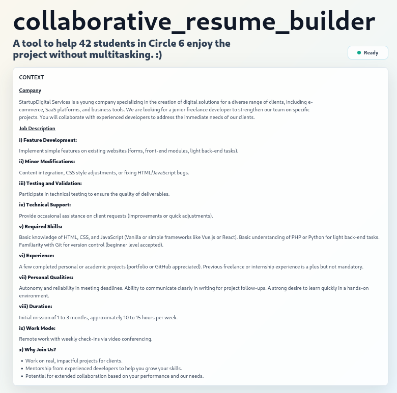
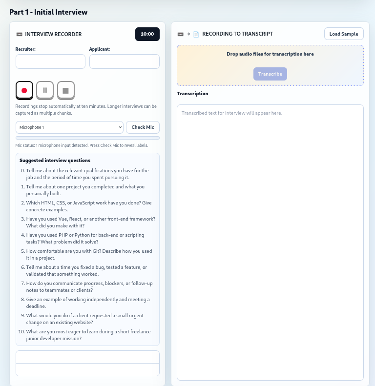
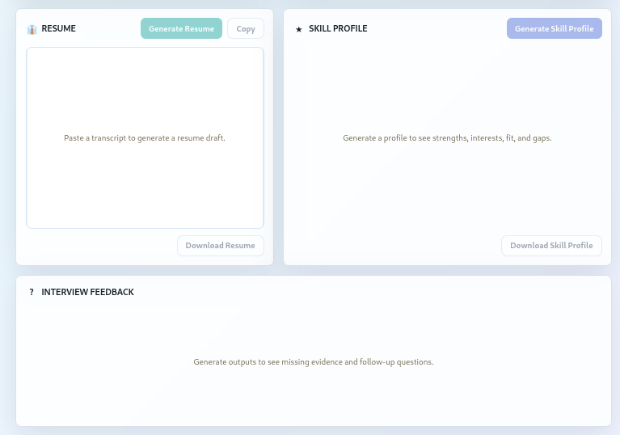
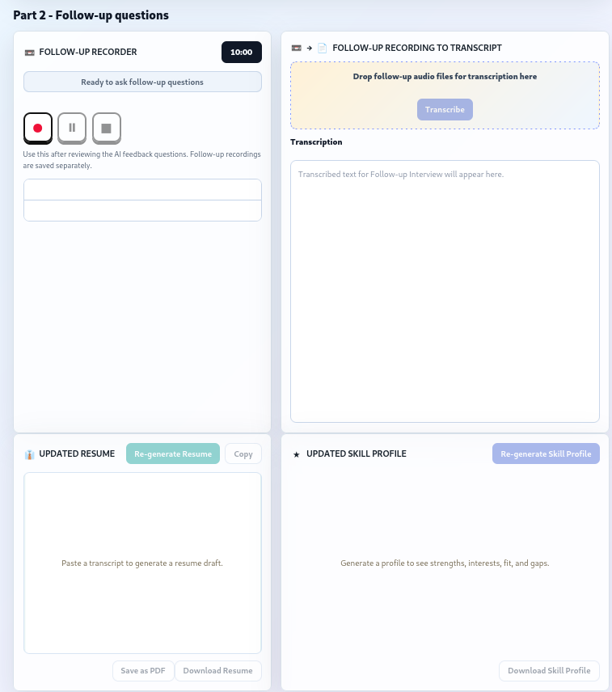
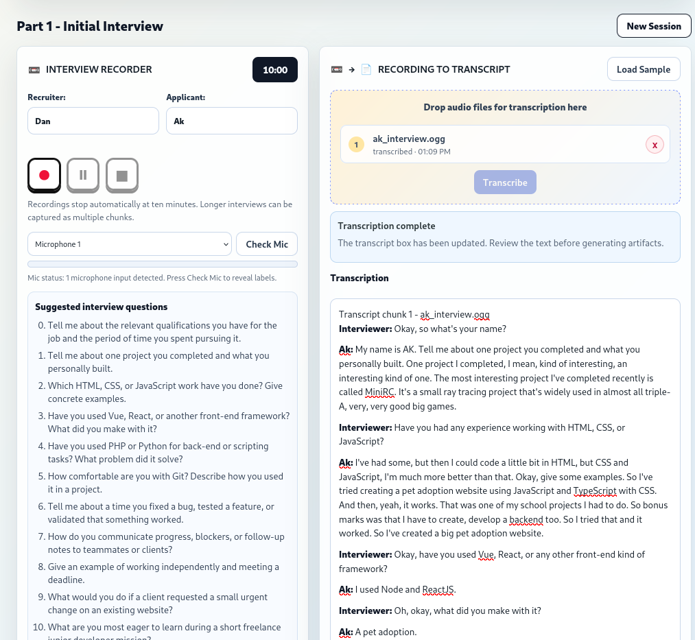
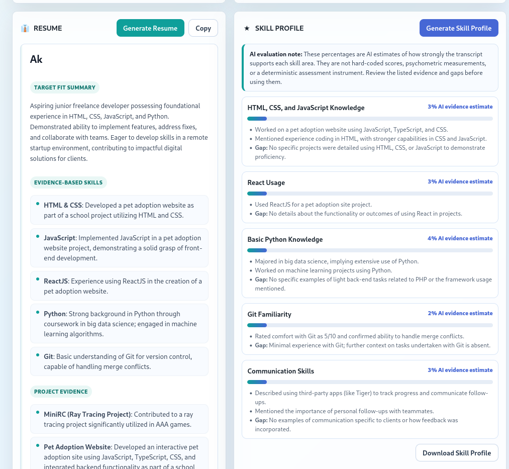
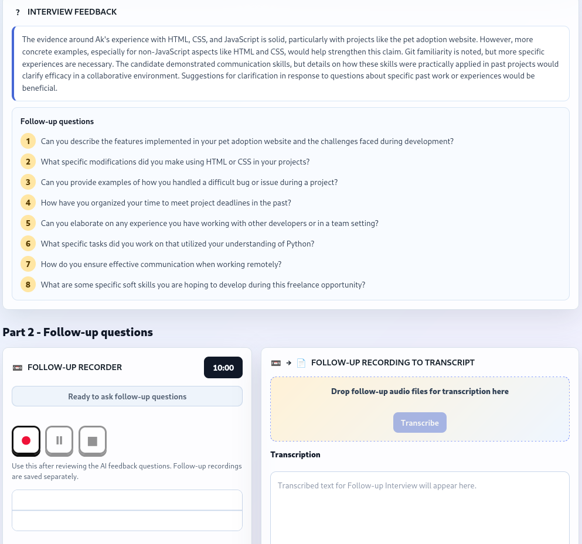

# Resume Builder

## Overview

This branch of `collaborative_resume_builder` is now a regular job seeker resume builder.

The app helps a job seeker build a targeted, evidence-backed resume for a specific job. It collects job context, applicant information, interview answers, follow-up answers, and then turns that material into structured evidence before generating resume/profile artifacts.

The current product caption is:

```text
Build a resume for the job you want
```

This project still preserves earlier 42 collaborative-resume documentation as process history, but the active branch direction is broader than the original school-project use case.

### Problem

Most AI resume builders jump directly from raw user input to a polished resume. That creates a trust problem: the output can look professional even when the evidence is weak, missing, or invented.

This app is designed around a different question:

```text
What evidence do we actually have for this candidate, and how does it relate to the job?
```

The resume should be the final output of an evidence workflow, not a direct rewrite of interview text.

### Outcome

The current prototype uses a six-step workflow:

1. Context Setting
2. Applicant Information
3. Part 1 - Initial Interview
4. Generate Resume / Skill Profile / Candidate Profile
5. Part 2 - Interview Feedback and Follow-up Questions
6. Generate Full Resume

Current measurable outcomes:

- Simulated single-user login with `css` / `12345678`.
- Job context intake by link, document upload, manual paste, or image/screenshot upload.
- AI-assisted job image OCR/classification where provider support exists.
- Applicant information with highest qualification and additional qualifications by month/year.
- Initial interview audio transcription or per-question text answers.
- Structured evidence objects generated from applicant and interview data.
- Competency classification as High Evidence, Medium Evidence, Weak Evidence, or Missing.
- Follow-up questions targeted to weak/missing competencies.
- Evidence review cards with filters and ignore/restore controls.
- Final evidence check before full resume generation.
- Resume evidence map showing which evidence supports each resume bullet.

This is a prototype, not a validated hiring assessment system.

For the clearest explanation of the current product logic, read [`docs/CURRENT_BUILD_SENSEMAKING.md`](docs/CURRENT_BUILD_SENSEMAKING.md).

## Reviewer Quick Links

- Open the visual flow page: [`collaborative_resume_builder_flow.html`](collaborative_resume_builder_flow.html)
- Direct flow page: [`docs/collaborative_resume_builder_flow.html`](docs/collaborative_resume_builder_flow.html)
- Technical build explanation: [`docs/TECHNICAL_BUILD.md`](docs/TECHNICAL_BUILD.md)
- Current build sensemaking: [`docs/CURRENT_BUILD_SENSEMAKING.md`](docs/CURRENT_BUILD_SENSEMAKING.md)

The flow pages are repository documentation. Open them directly from GitHub/repository view, or open the HTML files from the local folder in a browser. The local app server at `http://localhost:4173` serves the built prototype, not the documentation pages.

## Demo

From the user's perspective:

1. Open the app at `http://localhost:4173`.
2. Log in with the simulated credentials `css` / `12345678`.
3. Add job context by link, upload, image/screenshot, or manual paste.
4. Add applicant information, including highest qualification and additional qualifications.
5. Generate interview questions from the job description.
6. Record/transcribe the initial interview, or answer each question in text.
7. Generate resume/profile artifacts and review the structured evidence cards.
8. Ignore evidence that should not be used.
9. Review weak/missing competencies and answer targeted follow-up questions.
10. Refresh the final evidence check.
11. Generate the final resume.
12. Review the Evidence Used section to see which evidence supports each resume bullet.

For a reviewer-friendly visual version of this flow, open [`docs/collaborative_resume_builder_flow.html`](docs/collaborative_resume_builder_flow.html) in a browser.

### Screenshots

The screenshots below show the main user journey from context review to interview capture, resume generation, and follow-up questioning.















## Technology Stack

### Frontend components

- Vite 2.9
- TypeScript 4.9
- Browser MediaRecorder API for microphone capture
- Browser Web Audio API for microphone testing and waveform display
- HTML/CSS rendered from `src/main.ts`
- Local file download and LaTeX resume export

### Backend components

- Node.js local HTTP server in `server/index.cjs`
- `/api/transcribe` endpoint for audio transcription
- `/api/generate-artifacts` endpoint for resume/profile generation
- Server-side `.env` API key loading
- Gemini transcription/generation as the first provider
- OpenAI transcription/generation as fallback when configured

The backend exists so API keys do not need to be exposed in browser JavaScript.

For a deeper end-to-end explanation of how the browser, local server, audio APIs, AI providers, and export flow work together, see `docs/TECHNICAL_BUILD.md`.

## Development Approach With AI

### AI collaboration journey and evidence trail

This project was not built by blindly accepting AI output. The build followed a clarity-before-build process:

```text
Builder intent
-> AREN vision clarity
-> North Star and Architecture docs
-> Codex + KRYSTALIZE implementation clarity
-> working prototype
-> transcript/output testing
-> refinement and documentation
```

The repository documents this journey through several layers:

| Documentation | What it shows |
| --- | --- |
| [`docs/NORTH_STAR.md`](docs/NORTH_STAR.md) | The product purpose and long-term intent before implementation. |
| [`docs/ARCHITECTURE.md`](docs/ARCHITECTURE.md) | The conceptual system structure and current prototype architecture. |
| [`docs/TECHNICAL_BUILD.md`](docs/TECHNICAL_BUILD.md) | How the current stack works technically from browser recording to backend AI calls and export. |
| [`docs/AI_COLLABORATION.md`](docs/AI_COLLABORATION.md) | The roles of Builder, AREN, KRYSTALIZE, Codex, Gemini, and OpenAI. |
| [`docs/K_COLLABORATIVE_RESUME_BUILDER_CONSTITUTIONAL_STATE.md`](docs/K_COLLABORATIVE_RESUME_BUILDER_CONSTITUTIONAL_STATE.md) | Current stabilized understanding, locked truths, accepted uncertainty, and superseded assumptions. |
| [`docs/K_COLLABORATIVE_RESUME_BUILDER_CONSTITUTIONAL_JOURNAL.md`](docs/K_COLLABORATIVE_RESUME_BUILDER_CONSTITUTIONAL_JOURNAL.md) | The chronological clarification journey and rationale for major changes. |

The process matters because the final app evolved through testing and correction. For example, early keyword-based resume generation produced weak output, so the build moved to evidence-governed AI generation with explicit missing-evidence feedback. The follow-up interview loop was then added so the app could help collect the missing evidence instead of merely reporting gaps.

### AI tools, services, and models

- Codex was used as the main AI coding collaborator.
- Gemini API is used for transcription and evidence-governed generation when `GEMINI_API_KEY` is configured.
- OpenAI API is used as fallback when `OPENAI_API_KEY` is configured.
- Gemini app/manual transcription was kept as a fallback path when automated transcription fails.

### AI agent roles

- Builder: defines project intent, tests the app, rejects incoherent output, and makes product decisions.
- Arche Reconstruction & Engineering Nexus (AREN): a custom GPT used for high-level reasoning before implementation. AREN helped produce the North Star and Architecture documents so the project had vision clarity before coding began.
- KRYSTALIZE: used with Codex to preserve implementation clarity: state, locked truths, unresolved issues, rationale, dependencies, and semantic evolution.
- Codex: implements code changes, updates documentation, explains tradeoffs, and turns clarified decisions into working repository artifacts.
- Gemini/OpenAI generation layer: transcribes audio and generates structured evidence-based artifacts.

See `docs/AI_COLLABORATION.md` for the fuller collaboration-role breakdown.

The build method is clarity before build:

```text
AREN -> vision clarity
Codex + KRYSTALIZE -> implementation clarity
Codex -> working prototype
Gemini/OpenAI -> runtime AI features
```

### Key prompts and instructions

The backend prompts enforce these boundaries:

- Use the transcript as the only source for candidate claims.
- Use the job description only to evaluate fit and identify missing evidence.
- Do not invent skills, tools, dates, achievements, or project details.
- If a required job skill is not evidenced, mark it as a gap and ask a follow-up question.
- Return structured JSON for resume, profile cards, feedback, and follow-up questions.

The manual transcription fallback prompt asks the user to transcribe audio chunks in order, preserve speaker labels, combine the chunks, and avoid summarizing.

### Key review points and decisions

- Decision: build V1 before full Google Drive/Docs automation.
  Rationale: prove the interview-to-resume loop before spending effort on OAuth, Drive permissions, Docs formatting, or cloud storage.

- Decision: add automated transcription as V2A through a local backend.
  Rationale: transcription is the highest-value automation step, but it can be isolated from Google login and Drive integration.

- Decision: reject keyword-only resume generation.
  Rationale: early output was incoherent and treated weak keywords as evidence. Resume claims must be transcript-grounded.

- Decision: split the exercise into Part 1 and Part 2.
  Rationale: missing-evidence feedback should lead to a second interview pass, not sit unused on the screen.

- Decision: move final resume export to the updated Part 2 resume.
  Rationale: the final exported LaTeX resume should include follow-up evidence.

## Installation

Install dependencies:

```sh
npm install
```

Create a local environment file:

```sh
cp .env.example .env
```

Add your own API keys to `.env`:

```sh
GEMINI_API_KEY=your_gemini_api_key_here
OPENAI_API_KEY=your_openai_api_key_here
```

At least one provider key is needed for automated transcription and AI generation. Gemini is tried first; OpenAI is used as fallback when configured.

Do not commit `.env`.

## Usage

For development:

```sh
npm run dev
```

For the local backend with transcription and generation:

```sh
npm run build
npm run serve
```

Then open:

```text
http://localhost:4173
```

Useful commands:

```sh
npm run build
node --check server/index.cjs
```

Expected behavior:

- If microphone permission is granted and input volume is active, the waveform and mic-level indicator should respond.
- If the recruiter or applicant name is missing in Part 1, recording is blocked with a message.
- If the Part 2 ready button has not been clicked, follow-up recording is blocked with a message.
- If automated transcription fails, the app shows a manual fallback prompt.
- If AI generation fails, the app keeps the transcript and reports the failure rather than inventing output.

## Project Structure

```text
collaborative_resume_builder/
├── README.md
├── LICENSE
├── .gitignore
├── package.json
├── index.html
├── server/
│   └── index.cjs
├── src/
│   ├── main.ts
│   └── styles.css
└── docs/
    ├── NORTH_STAR.md
    ├── ARCHITECTURE.md
    ├── AI_COLLABORATION.md
    ├── KRYSTALIZE.md
    ├── KRYSTALIZE_PROTOCOL_NOTES.md
    ├── TECHNICAL_BUILD.md
    ├── K_COLLABORATIVE_RESUME_BUILDER_CONSTITUTIONAL_STATE.md
    └── K_COLLABORATIVE_RESUME_BUILDER_CONSTITUTIONAL_JOURNAL.md
```

Key folders:

- `src/`: browser UI, recording logic, transcript handling, artifact rendering, and LaTeX export.
- `server/`: local backend for AI transcription and generation.
- `docs/`: north star, architecture, technical build notes, AI collaboration notes, and Krystalize state/journal artifacts.
- `dist/`: generated production build, ignored by git.
- `node_modules/`: installed dependencies, ignored by git.

Tests are not yet present. Current verification is by TypeScript build, backend syntax check, and manual browser testing.

## V2A Transcription Notes

The app sends uploaded audio to `/api/transcribe`. The backend keeps API keys out of browser code.

Provider order:

1. Gemini, when `GEMINI_API_KEY` is present.
2. OpenAI, when `OPENAI_API_KEY` is present.
3. Manual fallback prompt, when automated transcription fails.

Audio files are currently sent inline from browser to backend, so files should stay below the configured inline size limit. Larger-file support can be added later through provider file-upload APIs.

## Evidence Evaluation Notes

Before calling Gemini or OpenAI for resume/profile generation, the backend performs a local evidence gate. If the transcript has no applicant answers, appears to be only a functionality test, contains irrelevant/non-work-related claims, or contains broad self-claims without concrete backing, the app returns an insufficient-evidence artifact instead of asking an AI model to invent a resume.

The app also treats claims and evidence differently. A candidate saying "I am good at JavaScript" is not enough by itself; the transcript should include a project, task, tool use, qualification, result, duration, or concrete example before that claim becomes resume evidence.

The skill profile uses model-generated evidence cards. Each card includes:

- `label`: skill or role-fit area.
- `evidenceStrength`: a 0-100 estimate of transcript support.
- `evidence`: transcript-grounded reasons.
- `gap`: missing or unclear evidence.

`evidenceStrength` is an AI-generated estimate. The app does not calculate this number with a hard-coded heuristic, rubric formula, psychometric instrument, or deterministic scoring engine. Gemini/OpenAI returns the estimate after reasoning over the transcript evidence and comparing it against the job description.

Because the model's internal reasoning is not fully inspectable, the number should be treated as AI judgment, not objective measurement. The useful part is the visible evidence and gap text beside each score: participants can inspect what the AI used to justify the estimate and decide whether more follow-up questions are needed.

Low scores should guide better follow-up questions. They should not be used as hiring scores or formal ability scores.

## Privacy and Responsibility

The `collaborative_resume` project involves personal resume information. Users should:

- Avoid recording private information that should not appear in a resume.
- Review AI-generated text before exporting.
- Remove unsupported or sensitive claims.
- Only publish or submit resumes that belong to them or that they have permission to submit.
- Delete intermediate private documents after project validation if required by the school project.

## Reflection

### Insights

I built this project from a simple belief: **a person does better work when they are allowed to focus on one task well**.

In the `collaborative_resume` project, students are asked to do many things at once:

- interview their partner;
- listen carefully;
- take notes;
- evaluate answers against the company context;
- remember useful evidence;
- write a resume that fits the role.

That creates **cognitive overload**. When the workflow becomes too heavy, students may stop engaging with the interview as a learning experience and focus only on finishing the resume.

The real learning is not only in the final resume. The real learning is in:

- asking better questions;
- listening to another person;
- noticing what is missing;
- clarifying vague claims;
- understanding how experience becomes evidence.

My insight was to **offload the mechanical and memory-heavy work to AI**:

- recording;
- transcription;
- information storage;
- evidence checking;
- resume drafting;
- follow-up question generation.

This lets the human interviewer focus on what AI cannot replace: **human connection, attention, and judgment**.

The app is therefore not meant to replace the `collaborative_resume` learning experience. It is meant to protect it.

The resume is the artifact. **The conversation is the learning.**
