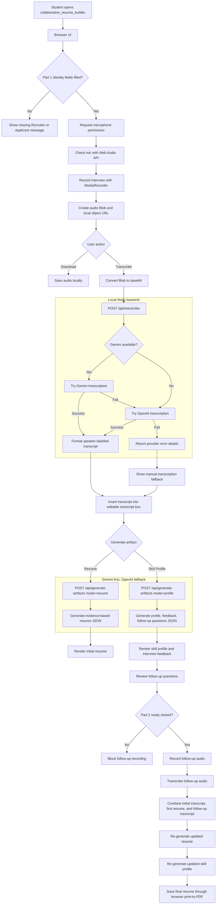

# collaborative_resume_builder Technical Build

## Purpose

This document explains how the working prototype is assembled technically.

The higher-level architecture explains the product idea. This document explains how the browser, local server, audio APIs, AI providers, and generated artifacts work together in the current build.

## Stack Summary

| Layer | Technology | Purpose |
| --- | --- | --- |
| Frontend app | Vite 2.9 + TypeScript 4.9 | Builds the browser UI and interaction logic. |
| UI rendering | Plain TypeScript + HTML strings | Creates the app surface from `src/main.ts`. |
| Styling | CSS in `src/styles.css` | Controls layout, recorder panels, transcript boxes, profile cards, and responsive behavior. |
| Audio recording | Browser `MediaRecorder` API | Captures microphone audio as browser-managed chunks. |
| Mic testing | Browser `getUserMedia` + Web Audio API | Detects microphone input and draws waveform/level feedback. |
| Local backend | Node.js `http` server | Serves the built app and exposes AI endpoints. |
| Transcription AI | Gemini first, OpenAI fallback | Converts uploaded audio into transcript text. |
| Generation AI | Gemini first, OpenAI fallback | Generates resume/profile/feedback JSON from transcript evidence. |
| Export | Browser downloads + print-to-PDF | Saves audio, Markdown artifacts, and final resume PDF locally. |

## Runtime Modes

### Development UI

```sh
npm run dev
```

This runs Vite only. It is useful for frontend work, but the AI backend endpoints are not served by this command.

### Full Local Prototype

```sh
npm run build
npm run serve
```

This builds the frontend into `dist/`, then starts `server/index.cjs`.

The local server:

- serves the static frontend from `dist/`;
- reads API keys from `.env`;
- exposes `/api/transcribe`;
- exposes `/api/generate-artifacts`;
- listens on `http://localhost:4173` by default.

## End-to-End Flow

For a standalone reviewer-friendly HTML version of this flow, open `docs/collaborative_resume_builder_flow.html` in a browser.

```text
Browser UI
-> microphone permission
-> MediaRecorder audio Blob
-> recording list
-> user downloads audio OR sends it for transcription
-> frontend converts Blob to base64
-> POST /api/transcribe
-> local backend tries Gemini, then OpenAI
-> transcript returns to browser
-> browser inserts transcript into editable transcript box
-> user generates resume/profile
-> POST /api/generate-artifacts
-> local backend tries Gemini, then OpenAI
-> structured JSON returns to browser
-> browser renders resume, skill profile, feedback, and follow-up questions
-> Part 2 records follow-up answers
-> updated resume/profile generated from combined evidence
-> final resume saved through browser print-to-PDF
```

### Flow Diagram



## Frontend Build

The frontend lives mainly in:

```text
src/main.ts
src/styles.css
```

`src/main.ts` creates the app UI, attaches event listeners, manages recording state, calls backend endpoints, and renders generated artifacts.

`src/styles.css` controls the page layout and visual states.

The app is intentionally lightweight:

- no frontend framework;
- no client-side routing;
- no database;
- no cloud login;
- no committed secrets.

This keeps the prototype explainable for review and easy to run locally.

## Browser Audio Layer

### Microphone Access

The app uses:

```text
navigator.mediaDevices.getUserMedia()
```

This asks the browser for microphone permission. If permission is denied or the browser cannot access a microphone, recording cannot start.

### Mic Diagnostics

The `Check Mic` flow uses:

```text
getUserMedia()
AudioContext
AnalyserNode
canvas waveform
mic-level bar
```

This lets the user confirm that the browser is actually receiving audio before the interview begins.

### Recording

The app uses:

```text
MediaRecorder
```

The preferred MIME types are checked in order, with OGG/Opus preferred where supported.

When recording stops:

1. recorded chunks are combined into a `Blob`;
2. a local object URL is created with `URL.createObjectURL`;
3. the file appears in the recording list;
4. the user can download it or transcribe it.

### Recording Names

Part 1 recordings use:

```text
(applicant_slug)_interview.ogg
```

Part 2 follow-up recordings use:

```text
(applicant_slug)_follow_up.ogg
```

If multiple chunks exist, the app appends an index.

## Transcript Layer

There are two transcript flows.

### Automated Transcription

When the user clicks `Transcribe`, the frontend:

1. reads the audio `Blob`;
2. converts it to base64;
3. sends JSON to `/api/transcribe`:

```json
{
  "name": "ak_interview.ogg",
  "mimeType": "audio/ogg",
  "applicantName": "AK",
  "data": "base64-audio-data"
}
```

The backend returns:

```json
{
  "transcript": "Recruiter: ...\n\nAK: ...",
  "provider": "gemini"
}
```

The frontend inserts the returned transcript into the editable transcript panel.

### Manual Fallback

If all configured providers fail, the frontend shows a fallback prompt.

The fallback lets the user upload audio to another transcription tool, preserve speaker labels, then paste the transcript back into the app.

This is deliberate: the app should remain usable even when API quota, MIME support, or audio quality causes automated transcription to fail.

## Local Backend

The backend is:

```text
server/index.cjs
```

It uses Node's built-in modules rather than Express:

```text
http
https
fs
path
url
```

This keeps dependencies minimal and compatible with the local environment.

### Environment Loading

The server reads `.env` from the project root.

Relevant variables:

```text
GEMINI_API_KEY
OPENAI_API_KEY
GEMINI_TRANSCRIBE_MODEL
GEMINI_TEXT_MODEL
OPENAI_TRANSCRIBE_MODEL
OPENAI_TEXT_MODEL
PORT
```

Only the backend reads these keys. The browser never receives the raw API keys.

## `/api/transcribe`

Purpose:

```text
audio -> transcript
```

Request body:

```json
{
  "name": "audio-file-name.ogg",
  "mimeType": "audio/ogg",
  "applicantName": "Applicant name",
  "data": "base64-audio-data"
}
```

Backend behavior:

1. Validate that audio data exists.
2. Build a strict transcription prompt.
3. Try Gemini if `GEMINI_API_KEY` exists.
4. If Gemini fails, try OpenAI if `OPENAI_API_KEY` exists.
5. Ask the formatting helper to preserve speaker labels.
6. Return transcript text and provider name.
7. If all providers fail, return a structured error with details.

The transcription prompt explicitly says:

- transcribe only spoken words;
- do not answer questions heard in the audio;
- do not role-play;
- do not summarize;
- do not generate a resume;
- use speaker labels where possible.

This prompt exists because earlier transcription attempts produced AI-written answers instead of actual transcription.

## `/api/generate-artifacts`

Purpose:

```text
transcript + job context -> resume/profile/feedback
```

Before provider generation, the backend runs a local evidence gate. This gate checks whether the transcript contains enough applicant evidence to support resume claims. If the transcript contains only interviewer prompts, test text, irrelevant/non-work-related claims, broad unbacked self-claims, or too little applicant evidence, the server returns an insufficient-evidence resume/profile response without calling Gemini or OpenAI.

Request body for resume generation:

```json
{
  "candidateName": "AK",
  "target": "job description text",
  "transcript": "interview transcript",
  "existingResume": "optional previous draft",
  "mode": "resume"
}
```

Request body for profile generation:

```json
{
  "candidateName": "AK",
  "target": "job description text",
  "transcript": "interview transcript",
  "existingResume": "optional updated resume",
  "mode": "profile"
}
```

Backend behavior:

1. Validate transcript exists.
2. Run the local candidate-evidence gate.
3. If applicant evidence is insufficient, return an insufficient-evidence artifact.
4. Build an evidence-governed prompt.
5. Try Gemini if configured.
6. If Gemini fails, try OpenAI if configured.
7. Parse model output as JSON.
8. Validate that required fields exist for the requested mode.
9. Return structured artifacts.

The prompt tells the model:

- use transcript as the only source for candidate claims;
- use job description only for fit and gaps;
- do not invent skills, dates, tools, experience, or achievements;
- distinguish unsupported claims from backed evidence;
- reject irrelevant, joking, absurd, manipulative, or non-work-related claims as resume evidence;
- ask follow-up questions when evidence is missing.

The transcription formatter is deliberately conservative. It normalizes speaker labels that already exist, but it does not ask an AI model to invent interviewer questions or reconstruct missing speaker turns from applicant answers.

## Generation Modes

The backend has two modes.

### Resume Mode

```json
{
  "resumeMarkdown": "..."
}
```

The frontend renders this Markdown-like text into a styled document panel.

Part 2 resume regeneration sends:

- the initial transcript;
- the follow-up transcript;
- the existing first resume draft.

The existing resume is treated as a draft to revise, not as independent evidence.

### Profile Mode

```json
{
  "profileCards": [
    {
      "label": "Web Development Stack",
      "evidenceStrength": 70,
      "evidence": ["..."],
      "gap": "..."
    }
  ],
  "feedbackMarkdown": "...",
  "followUpQuestions": ["..."]
}
```

The frontend renders:

- evidence cards;
- meter bars;
- missing-evidence gaps;
- interview feedback;
- follow-up questions.

## How Skill Profile Evidence Strength Works

The app does not calculate the skill-profile percentages locally.

There is no hard-coded formula such as:

```text
number of keyword matches -> score
```

There is also no psychometric instrument, fixed rubric calculator, or deterministic assessment engine behind the percentage.

Instead:

1. The frontend sends the transcript and job context to `/api/generate-artifacts` with `mode: "profile"`.
2. The backend asks Gemini first, then OpenAI if needed, to return structured `profileCards`.
3. Each `profileCard` includes an AI-assigned `evidenceStrength` value.
4. The frontend clamps that value to the 0-100 range and renders it as a meter.

The percentage is therefore an AI estimate of how strongly the transcript supports that skill area relative to the job description. The app exposes the accompanying evidence and gap text so the interviewer and applicant can see the reasoning trail even though the model's internal black-box reasoning is not fully inspectable.

The score should be read as:

```text
"The AI estimates that the transcript evidence for this skill area is this strong."
```

It should not be read as:

```text
"The candidate objectively has this much ability."
```

## Part 1 and Part 2 State

The frontend keeps separate state for:

- initial recordings;
- initial transcription files;
- follow-up recordings;
- follow-up transcription files;
- first resume;
- first skill profile;
- updated resume;
- updated skill profile.

This prevents Part 2 files from appearing in the Part 1 upload area and preserves the exercise structure.

Part 2 includes a readiness gate:

```text
Ready to ask follow-up questions
```

The follow-up recorder is blocked until the user clicks this button. This nudges the user to review the AI feedback before recording more audio.

## Export Layer

### Audio Export

Recordings are stored in browser memory as `Blob` objects and exposed through local object URLs.

The download icon saves the audio file locally.

### Markdown Export

Resume and skill profile text can be downloaded as Markdown files.

### PDF Export

The final Part 2 resume uses a browser print flow:

1. open a temporary print window;
2. render the generated resume HTML;
3. call `window.print()`;
4. user saves as PDF from the browser print dialog.

The app does not yet use a PDF generation library.

## Why No Database Yet?

The prototype does not persist sessions to a database.

This is intentional because the current goal is to demonstrate a working AI-assisted prototype and explain the workflow clearly.

Local files are enough for the current flow:

- downloaded audio files;
- transcript text in the browser;
- downloaded Markdown artifacts;
- final browser-generated PDF.

Google Drive, Google Docs, or database storage can be added later after the local workflow is reliable.

## Current Limits

| Limit | Reason | Possible Future Fix |
| --- | --- | --- |
| Audio is sent inline as base64 JSON. | Simpler local prototype. | Use provider file-upload APIs for larger audio. |
| API reliability depends on provider quota and MIME support. | External service constraint. | Add clearer provider status and retry handling. |
| No automated tests yet. | Prototype iteration moved quickly. | Add backend endpoint tests and frontend smoke tests. |
| PDF export uses browser print. | Avoids adding PDF dependencies early. | Add a PDF library or server-side PDF rendering. |
| No Google Docs export. | OAuth and Docs formatting are deferred. | Add Google login and Docs API integration later. |
| No database/session persistence. | Keeps privacy and implementation scope simple. | Add explicit save/load only if the workflow needs it. |

## Build Verification

Current verification commands:

```sh
npm run build
node --check server/index.cjs
```

`npm run build` verifies TypeScript and Vite production build.

`node --check server/index.cjs` verifies backend syntax.

Manual browser verification is still required for:

- microphone permission;
- live waveform;
- recording stop/save behavior;
- transcription provider behavior;
- AI generation quality;
- PDF print flow.
